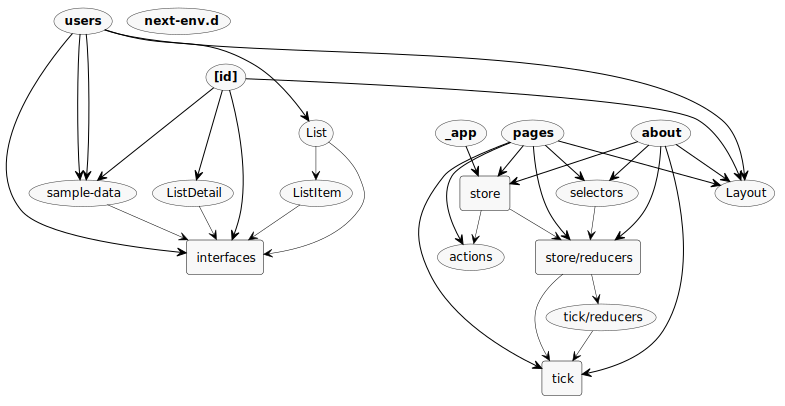

# TypeScript / Next.js / Redux / Thunk Template

With the new capabilities of NextJS, the way people are constructing their pages, are changing a little bit.
As Next, brings again the performance of static pages, many applications are migrating to this, but when we want to
use state management tools such as Redux or MobX, remembering now that we are in a static environment, some different
approaches need to be taken in order to inject Redux stores in the components of different static pages, preserving the
values in the store's state.

As each of the export components in the [pages](./pages) folder, will act as a static page, so now we need to inject 
the Redux store with a wrapper in each of the exported components, whose we want to use Redux capabilities.

Also this template has the capability of being deployed in two different platforms, Vercel and AWS(Serverless Framework).


## ⚙️ Technologies and Tools

This repo uses the following technologies:


## How this project was created?

In order to create a NextJS with Typescript app, the following commands were added.

Execute [`create-next-app`](https://github.com/vercel/next.js/tree/canary/packages/create-next-app) with [npm](https://docs.npmjs.com/cli/init) or [Yarn](https://yarnpkg.com/lang/en/docs/cli/create/) to bootstrap the example:

```bash
npx create-next-app --example with-typescript with-typescript-app
# or
yarn create next-app --example with-typescript with-typescript-app
```

Be aware that, this bootstrapping command, only creates a plain NextJS app, without Redux, in the next sections 
we will talk more about making Redux work with NextJS.

## How to Use This Template Instantly 

For making the things a little bit easier and straightforward, I have created a CLI template
generator for this project, just execute the following commands, that you will be able to
create an entire ready to go example, for starting your project:

```bash
npm install -g @felipemeriga/next-generator
next-generator
```

The cli is called next-generator and will ask you some questions, like if you want to use Redux or not,
whether to install dependencies or not, and also a name for your project.

After you run it, you will be able to directly run your project without any additional configuration.

## If you want to use without Redux, No need to Configure Nothing

This repo code is currently using Redux, to show how to configure and sync in a proper way, Redux together with
NextJS, but if you don't want to use Redux, and just have bootstrapped your app with the section above,
as default of new versions of NextJS, you don't need to override _app.tsx, or create a tsconfig.json file,
Next will do everything for you, you will just need to override in the case you really have a reason for that.

## How Does Redux works with Next

For default, in a normal React app, you would inject the Redux store through your app using the following definition, in the render
of your main component:
```typescript jsx
  render () {
    const {Component, pageProps, store} = this.props
    return <Container>
      <Provider store={store}>
        <Component {...pageProps} />
      </Provider>
    </Container>
  }
```
There are also another ways of injecting if you are using only functional components architecture, but with NextJS this doesn't
work, you need to use a wrapper to ensure that all the static pages will receive the store with the most updated values.

Setting up Redux for static apps is rather simple: a single Redux store has to be created that is provided to all pages.

When Next.js static site generator or server side rendering is involved, however, things start to get complicated as another store instance is needed on the server to render Redux-connected components.

Furthermore, access to the Redux Store may also be needed during a page's getInitialProps.

This is where next-redux-wrapper comes in handy: It automatically creates the store instances for you and makes sure they all have the same state.

Moreover it allows to properly handle complex cases like App.getInitialProps (when using pages/_app) together with getStaticProps or getServerSideProps at individual page level.

Library provides uniform interface no matter in which Next.js lifecycle method you would like to use the Store.

So, the main package used to create the wrapper it's located in the following repo, and you can know more about 
how this works in the background:

[next-redux-wrapper](https://github.com/kirill-konshin/next-redux-wrapper)

## How to Use [next-redux-wrapper](https://github.com/kirill-konshin/next-redux-wrapper)

Basically, you will create your Redux store, actions and reducers, regardless if you are using Thunk or Sagas, or nothing,
in the same way you do in normal react apps, but with [next-redux-wrapper](https://github.com/kirill-konshin/next-redux-wrapper) you will 
need to create some additional things, the makeStore and wrapper.

```typescript jsx
// This makeStore is needed for the wrapper, for every new page that is called, a new store with the current values will be created
const makeStore: MakeStore<any> = (context: Context) => createStore(reducers);

const wrapper = createWrapper<any>(makeStore, {debug: false});

export default wrapper;
```
So you will create this new configuration, using the combined reducers that you are used to do.

The makeStore is an object that will be created for every new static page call, which will create a new store with the current state values, and also
there is the wrapper, that will be used to wrapped Redux stores on your components.

After you have both of them, you need to override [_app.tsx](./pages/_app.tsx) with the following code:

```typescript jsx
// pages/_app.js
import React from 'react'
import App from 'next/app';
import wrapper from "../store";

// For default you don't need to edit _app.tsx, but if you want to wrapper the pages with redux wrapper, you need
// to override _app.tsx with this code bellow
class MyApp extends App {
    // @ts-ignore
    static async getInitialProps({Component, ctx}) {
        return {
            pageProps: {
                // Call page-level getInitialProps
                ...(Component.getInitialProps ? await Component.getInitialProps(ctx) : {}),
            }
        };
    }

    render() {
        const {Component, pageProps} = this.props;
        return (
            <Component {...pageProps} />
        );
    }

}

export default wrapper.withRedux(MyApp);
```

This will create the capability of connecting all your static pages to the Redux store, because your main app component it's
wrapped with [next-redux-wrapper](https://github.com/kirill-konshin/next-redux-wrapper).

## How to Connect a Component to Redux Store and Actions

After you have wrapped your _app.tsx component, in each of the reducers that you create, you will need to add the following action handler on the switch case:
```typescript jsx
case HYDRATE:
            // Attention! This will overwrite client state! Real apps should use proper reconciliation.
            return {...state};

```

In this repo example reducer, the entire code it's like this:
```typescript jsx
import {AnyAction} from "redux";
import {HYDRATE} from "next-redux-wrapper";
import ITickState from "./index";


const initialState: ITickState = {
    message: 'init'
};


export function tick(state: ITickState = initialState, action: AnyAction): ITickState {
    switch (action.type) {
        case HYDRATE:
            // Attention! This will overwrite client state! Real apps should use proper reconciliation.
            return {...state};
        case 'TICK':
            return {...state, message: action.payload};
        default:
            return state;
    }
}
```

This HYDRATE action, comes from the next-redux-wrapper package, and it's triggered every time a new component that connects 
with Redux it's opened, you can use that action to sync the values that will stay in the Store state, without loosing nothing
between the static pages.

With everything done, you just need to create a component for a page, and connect with Redux in the same way you used to do,
but now you need to place this following piece of code in the component.
```typescript jsx
// As the wrapper is injected in _app.tsx, for every component(page) that will interact with Redux and Thunk
// you need to place this piece of code bellow, that will get the static props from the wrapper, and inject on your
// component
export const getStaticProps = wrapper.getStaticProps(
    ({}) => {
    }
);
```

As the wrapper is injected in _app.tsx, for every component(page) that will interact with Redux,
you need to place this piece of code bellow, that will get the static props from the wrapper, and inject on your
component.

An example of an entire class component will look like:
```typescript jsx
import Link from 'next/link'
import Layout from '../components/Layout'
import {connect} from "react-redux";
import * as React from "react";
import {IStoreState} from "../store/reducers";
import {getTickState} from "../store/selectors";
import {updateTick} from "../store/tick/actions";
import {thunkAsyncFunction} from "../store";
import ITickState from "../store/tick";
import wrapper from "../store";

interface IProps {
    tick: ITickState
    updateAnnouncement: any
}

interface IState {}

interface IDispatchProps {
    onUpdateTick: (message: string) => ITickState,
    thunkAsyncFunction: () => Promise<any>;
}

type Props = IProps & IState & IDispatchProps

class App extends React.Component<Props> {

    constructor(props: Props) {
        super(props);
    }

    async componentWillUnmount(): Promise<void> {
        await this.props.thunkAsyncFunction();
    }

    render() {
        return (
            <Layout title="Home | Next.js + TypeScript Example">
                <h1>Hello Next.js 👋</h1>
                <p>
                    <Link href="/about">
                        <a>About</a>
                    </Link>
                </p>
                <div>
                    The current tick state: {this.props.tick.message}
                </div>
            </Layout>
        );
    }
}

const mapStateToProps = (state: IStoreState): {tick: ITickState} => ({
    tick: getTickState(state)
});

const mapDispatchToProps = (dispatch: any): IDispatchProps => {
    return {
        onUpdateTick: (message: string) =>
            dispatch(updateTick(message)),
        thunkAsyncFunction: () => dispatch(thunkAsyncFunction())
    }
};

export default connect(mapStateToProps, mapDispatchToProps)(App);

// As the wrapper is injected in _app.tsx, for every component(page) that will interact with Redux and Thunk
// you need to place this piece of code bellow, that will get the static props from the wrapper, and inject on your
// component
export const getStaticProps = wrapper.getStaticProps(
    ({}) => {
    }
);
```

If you prefer the functional component way, you can do:
```typescript jsx
// you can also use `connect()` instead of hooks
const Page: NextPage = () => {
    const {tick} = useSelector<State, State>(state => state);
    return (
        <div>{tick}</div>
    );
};

export default Page;

export const getStaticProps = wrapper.getStaticProps(
    ({}) => {
    }
);
```

## Application Diagram 


## Deploying to Vercel

Vercel is a serverless, no configuration approach to deploy NextJS, React, Node APIs applications, it's really straight
forward because you only need to point to a repo, where your source code is located, also Vercel already creates a CI/CD 
pipeline for deployment, and your app will be deployed instantly without any difficult configuration.

Additionally it's very scalable, because it sits on the top of Vercel CDN network, providing availability and
horizontal scalability.

You can also configure your own domain, and different from AWS, you don't need to configure anything on your machine, you just 
need to enter in Vercel, and sync your repo, where your application is stored, with your Vercel account, and start deploying it.

Deploy the example using [Vercel](https://vercel.com?utm_source=github&utm_medium=readme&utm_campaign=next-example):

[](https://vercel.com/new/git/external?repository-url=https://github.com/vercel/next.js/tree/canary/examples/with-typescript&project-name=with-typescript&repository-name=with-typescript)


## Deploying to AWS Using Serverless

Another way of deploying NextJS apps, it's as a lambda package on AWS, using [Serverless](https://www.serverless.com/) Framework,
which is a framework that helps you in deploying Lambda functions on AWS. It's very straight forward, and without any
difficult or additional configuration.

### Steps for deploying to AWS Lambda

#### 🔷 Part 1
For deploying it to AWS, you just need to make sure you have a valid AWS account, and your Access and Secret keys stored in
your computer as environment variables, you can to it by:
```shell script
export AWS_ACCESS_KEY_ID=<your-aws-access-key-id>
export AWS_SECRET_ACCESS_KEY=<your-aws-secret-access-key>
```

If you don't have an Amazon account, or haven't set the AWS credentials so far, you can take a look over this guide
[AWS - Credentials](https://www.serverless.com/framework/docs/providers/aws/guide/credentials/)

#### 🔷 Part 2

After this, you need to [Install Serverless Framework](https://www.serverless.com/framework/docs/providers/aws/guide/installation/)

#### 🔷 Part 3

Then, having Serverless framework installed on your machine, you just need to create a file named [serverless.yml](./serverless.yml)
on the root path of your NextJS App, but be aware that this file is already created in this repo, we are just
mentioning this in the case you want to add it to another project. So if you are using this repo, which already 
has the [serverless.yml](./serverless.yml) file, you don't need to create one.

If you have created a new one, you just need to add the following content in the file:
```yaml
# serverless.yml

# name of your application
myNextApplication:
  component: "@sls-next/serverless-component"

```

You can also edit the [serverless.yml](./serverless.yml) to add a specific domain, or configure additional settings, you can take
a look over them in this [Guide](https://www.serverless.com/blog/serverless-nextjs).

#### 🔷 Part 4

Execute the following command in the root path of the repo, to deploy it to your AWS account:

```shell script
serverless
```

#### 🔷 How does Serverless works in the background

We are currently using the [@sls-next/serverless-component]() for deploying our NextJS to Lambda on AWS account.
In the background, this component is not using CloudFormation to deploy, because it makes the deployment faster,
and bassically what happens, is that Serverless framework will build your NextJS application, will pack it and
save it to a new S3 bucket, a NodeJS lambda function will be created to host that packed application, and finally 
AWS Cloudfront will create a CDN distribution pointing to your application.

If you have also configured a domain, Route53 and ACM will be used to manage the DNS records and SSL certificates.
